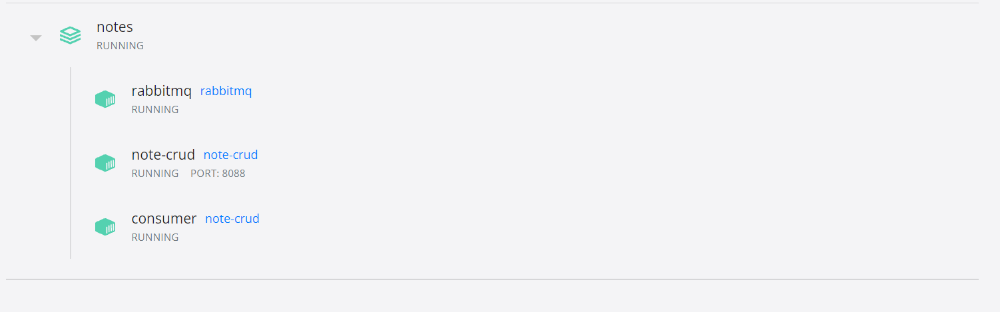

# Service for CRUD note, log tracking by RabbitMQ
## Architecture

Three components:
1. Service note CRUD, use a DB
2. RabbitMQ for saving messages pushed from service note CRUD when any of the C R U D tasks are performed
3. Comsumer for getting messages from a queue and saving them to another DB
## Set up
1. Install Docker and Docker compose
2. Clone this repository
3. At the root directory of this repository, run: `docker-compose up`
4. Healthcheck: curl http://localhost:8088/api/v1/healthcheck